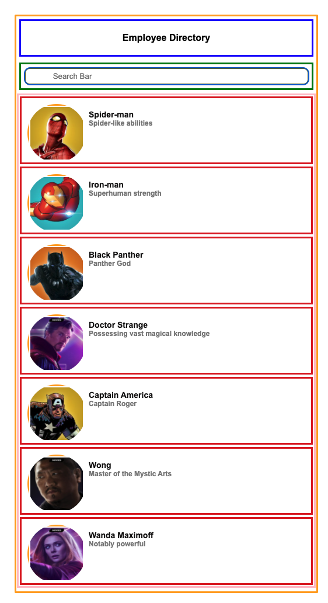

# Getting Started with Create React App
# [Netlify Live Link](https://magnificent-medovik-69f887.netlify.app/)

### Using your knowledge of State and Props

### Screenshot
1. Build only the left hand side of the above Diagram
2. You should create an APP, Homepage, Header, Search Bar, EmployeeList and Employee List Item

## Available Scripts

In the project directory, you can run:

### `npm start`

Runs the app in the development mode.\
Open [http://localhost:3000](http://localhost:3000) to view it in your browser.

The page will reload when you make changes.\
You may also see any lint errors in the console.

### `npm test`

### `npm run build`

